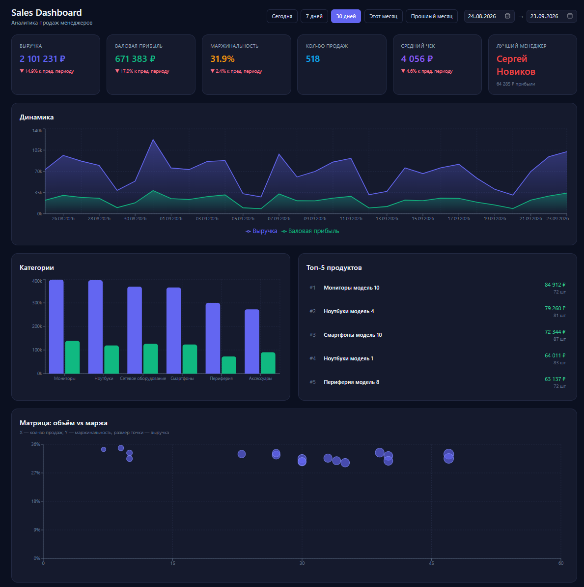
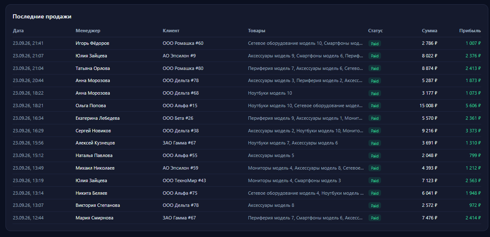
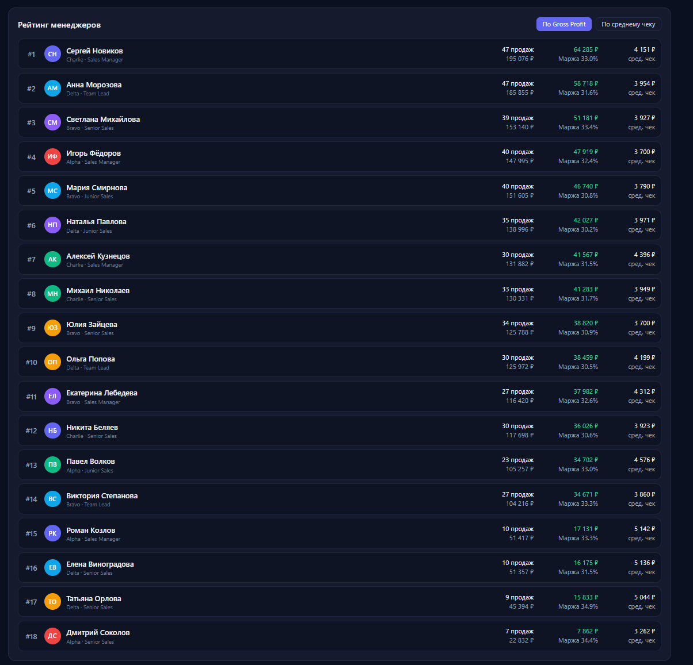

# Sales Performance Dashboard

[](https://github.com/Algorithmic-newtrading/sales-dashboard/actions/workflows/ci.yml)

Full-Stack приложение для анализа продаж менеджеров отдела. Backend на ASP.NET Core 8 + EF Core + PostgreSQL, frontend на React + TypeScript. Поднимается одной командой `docker compose up --build`.

## Скриншоты

### Dashboard — KPI, динамика, категории, scatter plot



### Рейтинг менеджеров



### Последние продажи



## Запуск

Требования: установленный Docker Desktop (Windows / macOS / Linux).

```bash
docker compose up --build
```

После старта (~1–2 минуты в первый раз) открыть:

- **Dashboard**: http://localhost:3000
- **Swagger API**: http://localhost:8080/swagger

Остановить:

```bash
docker compose down       # остановить, сохранить БД
docker compose down -v    # остановить и удалить БД
```

Повторный запуск без пересборки (когда код не менялся):

```bash
docker compose up
```

Полный сброс БД и seed-данных (если нужно пересоздать):

```bash
docker compose down -v
docker compose up --build
```

## Стек

| Слой | Технологии |
|------|-----------|
| Backend | C# 12, .NET 8, ASP.NET Core, EF Core 8, Npgsql |
| Frontend | React 19, TypeScript, Vite, TanStack Query, Recharts, Tailwind CSS, Framer Motion, Zustand |
| База | PostgreSQL 16 |
| Инфраструктура | Docker, Docker Compose, nginx |
| CI | GitHub Actions (backend + frontend jobs) |

## Структура

```
sales-dashboard/
├── .github/
│   └── workflows/
│       └── ci.yml                  # GitHub Actions
├── backend/
│   ├── SalesDashboard.Api/         # ASP.NET Core Web API
│   │   ├── Controllers/            # REST-эндпоинты
│   │   ├── Data/                   # DbContext, SeedData, SaleSeeder
│   │   ├── Dtos/                   # DTO для API
│   │   ├── Entities/               # 6 доменных моделей
│   │   ├── Migrations/             # EF Core миграции
│   │   └── Services/               # AnalyticsService
│   ├── SalesDashboard.Tests/       # xUnit тесты
│   └── SalesDashboard.sln
├── frontend/
│   └── src/
│       ├── api/                    # axios-клиент, эндпоинты
│       ├── components/             # KpiCard, Timeline, Categories, ManagerScatter, ...
│       ├── hooks/                  # useRange (Zustand)
│       ├── pages/                  # Dashboard
│       ├── types/                  # TS-типы DTO
│       └── utils/                  # csv, smooth
├── docs/                           # скриншоты дашборда
├── docker-compose.yml
├── README.md
├── AI_PROMPTS.md
└── AI_NOTES.md
```

## API

| Метод | Endpoint | Описание |
|-------|----------|----------|
| GET | `/api/analytics/kpi?from&to` | KPI за период |
| GET | `/api/analytics/managers?from&to&sortBy` | Рейтинг менеджеров (sortBy: `grossProfit` / `avgCheck`) |
| GET | `/api/analytics/timeline?from&to&granularity` | Динамика во времени (granularity: `day` / `month`) |
| GET | `/api/analytics/categories?from&to` | Продажи по категориям |
| GET | `/api/analytics/top-products?from&to&limit` | Топ продуктов |
| GET | `/api/analytics/recent-sales?from&to&limit` | Последние продажи |

**Формат дат:** `YYYY-MM-DD`. Все даты трактуются как UTC.

**Примеры:**

```
http://localhost:8080/api/analytics/kpi?from=2026-08-01&to=2026-09-23
http://localhost:8080/api/analytics/managers?from=2026-08-01&to=2026-09-23&sortBy=grossProfit
http://localhost:8080/api/analytics/timeline?from=2026-08-01&to=2026-09-23&granularity=day
```

## Dashboard

Единый desktop-экран для руководителя продаж, ~1440×900. Блоки:

1. **KPI-карточки** — выручка, валовая прибыль, маржинальность, количество продаж, средний чек, лучший менеджер. У большинства — дельта к предыдущему периоду.
2. **Фильтр периода** — пресеты (Сегодня / 7 дней / 30 дней / Этот месяц / Прошлый месяц) + произвольный диапазон `from → to`.
3. **Динамика** — area chart: Revenue и Gross Profit во времени. Переключатель **«Сырые данные / Сглаженные»** (экспоненциальное сглаживание, α = 0.3).
4. **Категории** — bar chart по выручке и прибыли.
5. **Топ-5 продуктов** — список с выручкой и количеством.
6. **Матрица: объём vs маржа** — scatter plot менеджеров: X = количество продаж, Y = маржинальность %, размер точки = выручка. Помогает найти звёзд (правый верх) и проблемные зоны (правый низ).
7. **Рейтинг менеджеров** — переключение между Gross Profit и Average Check. В строке: позиция, аватар-инициалы, команда/должность, продажи, выручка, GP, маржа, средний чек. Кнопка **«Экспорт CSV»**.
8. **Последние продажи** — дата, менеджер, клиент, товары, статус, сумма, GP. Кнопка **«Экспорт CSV»**.

## Business rules

### Revenue (Выручка)

Сумма всех **оплаченных** продаж за период:

```
Revenue = Σ (Quantity × UnitPrice) по SaleItems, где Sale.Status = Paid
```

### Refunded / Cancelled

**Refunded** и **Cancelled** продажи **исключаются** из всех агрегатов:

- не попадают в Revenue
- не попадают в Gross Profit
- не учитываются в количестве продаж
- не влияют на средний чек

**Обоснование:** продажи, которые не принесли денег, не должны искажать показатели эффективности менеджеров. Refunded — «разворот сделки», Cancelled — «сделка не состоялась». Обе категории равны по семантике для аналитики.

### Gross Profit (Валовая прибыль)

```
Gross Profit = Σ (Quantity × (UnitPrice - UnitCost)) по Paid-продажам
```

UnitCost сохраняется в SaleItem на момент продажи — это важно, потому что себестоимость может меняться со временем, а пересчитывать старые сделки по новым ценам некорректно.

### Margin (Маржинальность)

```
Margin = Gross Profit / Revenue × 100%
```

Округляется до 2 знаков. Если Revenue = 0, Margin = 0.

### Average Check (Средний чек)

```
Average Check = Revenue / SalesCount
```

SalesCount — количество **Paid-продаж** за период. Округляется до 2 знаков.

### Previous period (Предыдущий период)

Для сравнения KPI с «предыдущим периодом» используется **такой же по длине** интервал, идущий непосредственно перед текущим:

```
prevFrom = from - (to - from)
prevTo = from
```

Для произвольного диапазона длиной N дней — это предыдущие N дней. Для пресета «30 дней» — предыдущие 30 дней.

## Технические решения

### Индексы

- `Sales(Date)` — фильтр по времени
- `Sales(Status, Date)` — составной под запросы «Paid за период»
- `Sales(ManagerId)` — группировка по менеджеру
- `SaleItems(SaleId)`, `SaleItems(ProductId)` — JOIN-ы
- `Products(CategoryId)` — группировка по категориям

### Агрегация

Все агрегаты вычисляются **на сервере** через LINQ → SQL. Frontend получает уже готовые данные — в браузер не уходят тысячи продаж и не пересчитываются в JS.

### Воспроизводимость seed

Seed использует `new Random(fixedSeed)` — при пересоздании БД данные получаются одинаковыми. Файл `SaleSeeder.cs` собирает список продаж в память и сохраняет всё одной транзакцией — быстро и безопасно.

### DateTime и PostgreSQL

PostgreSQL хранит `timestamp with time zone`. Npgsql требует `DateTimeKind.Utc`. Query-параметры `?from=2026-09-01` приходят как `Unspecified`, поэтому в контроллере даты явно нормализуются в UTC через `DateTime.SpecifyKind(d, DateTimeKind.Utc)`.

### Экспорт CSV

Утилита `utils/csv.ts` — обобщённая функция `downloadCsv<T extends object>(filename, rows)`. Добавляет BOM (`\uFEFF`) для корректной кодировки кириллицы в Excel. Экранирует запятые, кавычки, переводы строк.

### Сглаживание графиков

Утилита `utils/smooth.ts` — простое экспоненциальное сглаживание:

```
smoothed[0] = raw[0]
smoothed[i] = α × raw[i] + (1 − α) × smoothed[i−1]
```

α = 0.3 — баланс между точностью и плавностью. Работает по обеим метрикам: Revenue и Gross Profit.

### Данные в seed

- 20 менеджеров (18 активных), распределены по 4 командам
- 80 клиентов в 3 сегментах (SMB / Mid-Market / Enterprise)
- 6 категорий, 60 товаров
- ~9500 продаж за 12 месяцев
- Сезонность (пик в декабре), меньше сделок по выходным
- «Сила» менеджеров — от 0.4× до 2.0×
- 88% продаж Paid, 7% Cancelled, 5% Refunded
- 1–4 позиции в продаже

## Тесты и CI

Проект покрыт автоматическими тестами — **12 штук**. GitHub Actions прогоняет их при каждом push и pull request.

### Backend (xUnit, 7 тестов)

- KPI исключает Cancelled и Refunded
- Margin = Gross Profit / Revenue × 100%
- Average Check = Revenue / SalesCount
- Пустой период → все метрики = 0
- Рейтинг менеджеров: сортировка по Gross Profit и Average Check
- Рейтинг: одинаковые результаты → одинаковый ранг
- Timeline: группировка по дням

Запуск:

```bash
cd backend
dotnet test
```

### Frontend (Vitest, 5 тестов)

- Store `useRange`: пресеты `7d` / `30d` / `today`
- Custom диапазон
- Формат `asRange` → строки `YYYY-MM-DD`

Запуск:

```bash
cd frontend
npm run test
```

### CI (GitHub Actions)

Workflow `.github/workflows/ci.yml` — два параллельных job'а:

- **Backend (.NET 8)** — `dotnet restore` + `build` + `test`
- **Frontend (Node 20)** — `npm ci` + `build` + `test`

Статус: [](https://github.com/Algorithmic-newtrading/sales-dashboard/actions/workflows/ci.yml)

## Что не успели за 8 часов

Всё заявленное в ТЗ и продуктовых инициативах реализовано.

## Что улучшили бы дальше

- Экспорт в Excel / PDF
- Кэширование KPI-запросов (Redis или in-memory на 30 секунд)
- Партиционирование таблицы Sales по дате при росте до сотен тысяч записей
- Материализованные представления для тяжёлых агрегатов
- Аутентификация и разграничение ролей (руководитель / менеджер)
- Реал-тайм обновление через WebSocket/SignalR
- Сравнение произвольных периодов side-by-side

## Разработка (без Docker)

**Backend:**

```bash
cd backend/SalesDashboard.Api
dotnet run
# API: http://localhost:5000, Swagger: http://localhost:5000/swagger
```

Требуется локальный PostgreSQL 16 (или изменить строку подключения в `appsettings.json`).

**Frontend:**

```bash
cd frontend
npm install
npm run dev
# http://localhost:5173
```

Vite-прокси автоматически направляет `/api/*` на `http://localhost:8080`.

## Оценка времени

| Этап | Ориентир |
|------|----------|
| Каркас проекта + Dockerfile | 30 мин |
| Доменные сущности + миграция | 45 мин |
| Seed-данные | 30 мин |
| AnalyticsService + контроллер | 1 ч |
| Компоненты dashboard (UI) | 2 ч |
| Scatter plot | 30 мин |
| CSV-экспорт + сглаживание | 30 мин |
| Тесты (backend + frontend) | 1 ч |
| CI (GitHub Actions) | 30 мин |
| Скриншоты + README | 30 мин |
| Отладка (DateTime, Recharts, Vite proxy) | 1.5 ч |
| Docker Compose + nginx | 30 мин |
| Документация | 45 мин |
| **Итого** | **~10 ч** |

## Лицензия

Тестовое задание. Свободное использование.